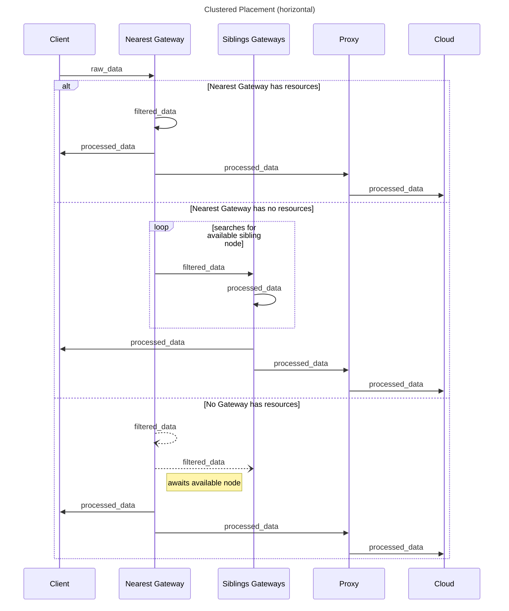

```mermaid


sequenceDiagram 

Title: Clustered Placement (horizontal)

participant C as Client
participant G as Nearest Gateway
participant G' as Siblings Gateways
participant P as Proxy
participant Cl as Cloud

 C->>G: raw_data

alt Nearest Gateway has resources
G->>G: filtered_data
G->>C: processed_data
G->>P: processed_data
P->>Cl: processed_data

else Nearest Gateway has no resources 
		 loop searches for available sibling node
				G->>G': filtered_data
                G'->>G': processed_data
			end
		G'->>C: processed_data
		G'->>P: processed_data
		P->>Cl: processed_data

else No Gateway has resources
        G--)G: filtered_data
        G--)G': filtered_data
        Note right of G: awaits available node
        G->>C: processed_data
		G->>P: processed_data
        %% P->>C: processed_data
        P->>Cl: processed_data
	end 
```