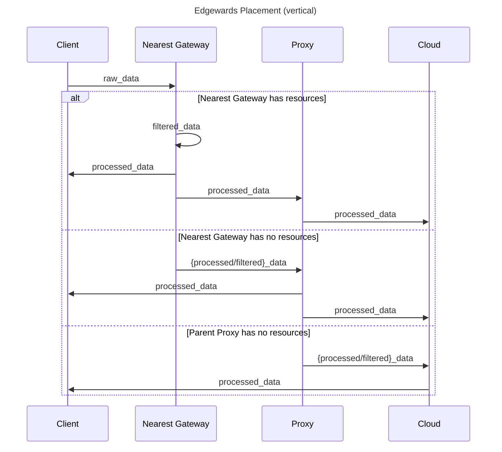

```mermaid
sequenceDiagram

title Edgewards Placement (vertical)

participant C as Client
participant G as Nearest Gateway
participant P as Proxy
participant Cl as Cloud
  
C->>G: raw_data

alt Nearest Gateway has resources
    G->>G: filtered_data
    G->>C: processed_data
    G->>P: processed_data
    P->>Cl: processed_data

else Nearest Gateway has no resources 
    G->>P: {processed/filtered}_data
    P->>C: processed_data
    P->>Cl: processed_data

else  Parent Proxy has no resources
    %% G->>P: {processed/filtered}_data
    P->>Cl: {processed/filtered}_data
    Cl->>C: processed_data
end
```
